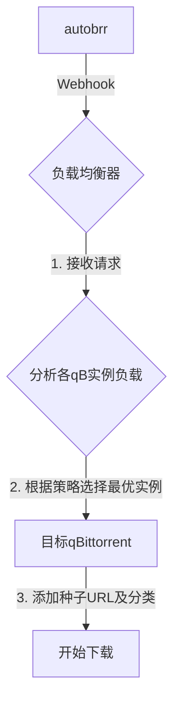

# qBittorrent 智能负载均衡器

一个为 qBittorrent 多实例设计的智能负载均衡器。通过 webhook 接收来自 [autobrr](https://github.com/autobrr/autobrr) 的种子添加请求，并根据实例的实时状态（如上传/下载速度、活跃任务数）自动将新种子分配到最优的 qBittorrent 实例。

## 核心功能

- **智能负载均衡**: 根据可配置的算法（上传速度、下载速度或活跃下载数）动态选择最佳实例。
- **Webhook 驱动**: 通过 HTTP API 直接与 autobrr 集成，实现零延迟的实时处理。
- **智能分类**: 自动从 autobrr 发送的数据中提取 `indexer` 作为种子的分类。
- **自动重连**: 当与 qBittorrent 实例的连接中断时，系统会自动尝试重新连接。
- **自动 Announce**: 智能地对活动时间短的种子重新汇报给 Tracker，以快速获取更多 Peer。
- **Webhook 安全**: 通过配置一个长且复杂的随机 URL 路径来保护 Webhook 端点。
- **调试模式**: 支持将新添加的种子设置为暂停状态，方便调试。
- **详细日志**: 同时支持控制台和文件日志，日志文件按日期自动轮转。
- **健康检查**: 提供 `/health` 接口，可轻松集成到监控系统。

## 工作流程



## 部署方式

### Docker (推荐)

1.  **准备文件**:
    ```bash
    git clone <your-repo-url>
    cd <repo-folder>
    cp config.json.example config.json
    ```

2.  **修改配置**: 编辑 `config.json`，填入你的 qBittorrent 实例信息并设置一个**极其重要**的随机 `webhook_path`。

3.  **启动服务**:
    ```bash
    docker-compose up -d
    ```
    > 可选地，使用 `./docker-start.sh` 脚本管理服务。

4.  **配置 autobrr**: 在 autobrr 中添加 `Webhook` Action，指向 `http://<your-server-ip>:5000<your-webhook-path>` 并使用以下 `Body`:
    ```json
    {
      "release_name": "{{.TorrentName}}",
      "indexer": "{{.Indexer}}",
      "download_url": "{{.TorrentUrl}}"
    }
    ```

### 本地运行

1.  安装依赖: `pip install -r requirements.txt`
2.  创建并修改 `config.json`。
3.  运行程序: `python run.py`
4.  参考 Docker 步骤 4 配置 autobrr。

## 配置文件说明 (`config.json`)

| 参数 | 说明 |
|:--- |:---|
| `qbittorrent_instances` | **(必需)** qBittorrent 实例列表，包含 `name`, `url`, `username`, `password`。 |
| `webhook_port` | Webhook 监听端口 (默认: `5000`)。 |
| `webhook_path` | Webhook 访问路径。**必须设置为长且随机的字符串以确保安全**。 |
| `primary_sort_key` | 负载均衡的主要排序键。可选: `"upload_speed"`, `"download_speed"`, `"active_downloads"` (默认: `"upload_speed"`)。 |
| `max_new_tasks_per_instance` | 单个实例在一轮中能接收的最大新任务数 (默认: `2`)。 |
| `max_announce_retries` | 种子自动汇报给 Tracker 的最大尝试次数 (默认: `10`)。 |
| `connection_timeout` | 连接 qBittorrent 的超时时间（秒）(默认: `6`)。 |
| `reconnect_interval` | 实例断开后尝试重连的间隔（秒）(默认: `180`)。 |
| `max_reconnect_attempts` | 每次重连的最大尝试次数 (默认: `1`)。 |
| `log_dir` | 日志文件目录 (默认: 自动检测，Docker 为 `/app/logs`，本地为 `./logs`)。 |
| `debug_add_stopped` | 调试模式，若为 `true`，新种子将暂停 (默认: `false`)。 |

## 安全建议

应用的核心安全依赖于一个**秘密且无法被猜测的 Webhook 路径**。

1.  **使用长随机路径**: 在 `config.json` 中，`webhook_path` 必须设置为复杂字符串。
    - **❌ 错误**: `/webhook`, `/autobrr`, `/my-secret`
    - **✅ 正确**: `/webhook/secure-a8f9c2e1-4b3d-9876-abcd-ef0123456789`
2.  **保持私密**: 不要在任何公共场所泄露完整的 Webhook URL。
3.  **可选增强**: 使用防火墙限制端口访问，或在反向代理后运行此服务。

## API 接口

- `GET /health`: 健康检查接口，返回服务运行状态。
- `POST <your-webhook-path>`: 接收 autobrr 通知的端点。

## Docker 部署

### 📦 Docker 文件说明

- `Dockerfile` - Docker 镜像构建文件
- `docker-compose.yml` - Docker Compose 配置
- `docker-start.sh` - 便捷启动脚本
- `.dockerignore` - Docker 构建忽略文件

### 🚀 快速开始

#### 方式一：使用便捷脚本（推荐）

1. **给脚本添加执行权限**
```bash
chmod +x docker-start.sh
```

2. **首次启动（自动创建配置模板）**
```bash
./docker-start.sh
```

3. **修改配置文件**
编辑生成的 `config.json` 文件，配置您的 qBittorrent 实例信息。

4. **启动服务**
```bash
./docker-start.sh start    # 生产模式
```

#### 方式二：手动使用 Docker Compose

1. **创建配置文件**
```bash
cp config.json.template config.json
# 编辑 config.json 配置您的 qBittorrent 实例
```

2. **创建必要目录**
```bash
mkdir -p logs
```

3. **启动服务**
```bash
# 启动服务
docker-compose up -d
```

### 📋 Docker 脚本命令

```bash
./docker-start.sh <command>
```

| 命令 | 说明 |
|------|------|
| `start` / `prod` | 启动生产环境服务 |
| `stop` | 停止所有服务 |
| `restart` | 重启服务 |
| `logs` | 查看负载均衡器日志 |
| `build` | 重新构建Docker镜像 |
| `status` | 查看服务运行状态 |
| `clean` | 清理停止的容器 |
| `help` | 显示帮助信息 |

### 📁 Docker 目录结构

```
qbittorrent-loadbalancer/
├── main.py                    # 主程序
├── run.py                     # 启动脚本
├── requirements.txt           # Python依赖
├── config.json               # 配置文件（需要自己创建）
├── Dockerfile                # Docker镜像定义
├── docker-compose.yml        # Docker Compose 配置
├── docker-start.sh           # 便捷启动脚本
├── .dockerignore             # Docker构建忽略文件
└── logs/                     # 日志目录（挂载）
```

### ⚙️ Docker 配置说明

#### 环境变量

在 `docker-compose.yml` 中可以设置以下环境变量：

```yaml
environment:
  - PYTHONUNBUFFERED=1    # Python输出不缓冲
  - TZ=Asia/Shanghai      # 时区设置
```

#### 数据卷挂载

```yaml
volumes:
  - ./config.json:/app/config.json:rw      # 配置文件
  - ./logs:/app/logs:rw                    # 日志目录
```

#### 网络配置

服务使用默认的Docker网络，确保可以访问到您的qBittorrent实例。

### 🔧 Docker 故障排除

#### 1. 配置文件问题
```bash
# 检查配置文件语法
cat config.json | python -m json.tool
```

#### 2. 网络连接问题
```bash
# 检查容器网络
docker network ls

# 测试到qBittorrent实例的连接
docker run --rm alpine/curl curl -I http://your_qbittorrent_url:8080
```

#### 3. 服务日志
```bash
# 查看详细日志
docker-compose logs qbittorrent-loadbalancer

# 查看特定时间的日志
docker-compose logs --since="2024-01-01" qbittorrent-loadbalancer
```

#### 4. 重新构建镜像
```bash
# 清理并重新构建
docker-compose down
docker rmi qbittorrent-loadbalancer
./docker-start.sh build
./docker-start.sh start
```

### 📊 Docker 健康检查

Docker 镜像包含健康检查功能：

```bash
# 查看健康状态
docker ps --format "table {{.Names}}\t{{.Status}}"

# 查看健康检查日志
docker inspect qbt-loadbalancer | grep -A 10 "Health"
```

### 🔄 Docker 更新和维护

#### 更新代码
```bash
# 停止服务
./docker-start.sh stop

# 拉取最新代码
git pull

# 重新构建并启动
./docker-start.sh build
./docker-start.sh start
```

#### 数据备份
```bash
# 备份配置和日志
tar -czf backup-$(date +%Y%m%d).tar.gz config.json logs/

# 恢复
tar -xzf backup-20240101.tar.gz
```

### 🚨 Docker 注意事项

1. **确保 qBittorrent 实例可访问**
2. **配置正确的网络和防火墙规则**
3. **定期检查日志和服务状态**
4. **备份重要配置文件**
5. **监控磁盘空间使用情况**

## 日志文件

- `qbittorrent_loadbalancer.log`: 主日志文件（DEBUG级别）
- `qbittorrent_error.log`: 错误日志文件（ERROR级别）
- 日志文件按天轮转，保留7天

## 故障排除

### 常见问题

1. **连接失败**: 检查 qBittorrent Web UI 是否启用，URL、用户名和密码是否正确
2. **文件不被处理**: 检查文件权限，确保程序能读取监控目录
3. **重连失败**: 调整 `reconnect_interval` 和 `max_reconnect_attempts` 参数

### 调试技巧

- 启用 `debug_add_stopped: true` 可以暂停新添加的种子，便于调试
- 查看日志文件了解详细的运行状态
- 使用较短的 `status_update_interval` 获得更频繁的状态更新

## 性能优化

- 合理设置 `status_update_interval`：过短会增加网络负载，过长会降低响应速度
- 调整 `max_new_tasks_per_instance` 控制分配速度
- 根据网络环境调整 `connection_timeout` 